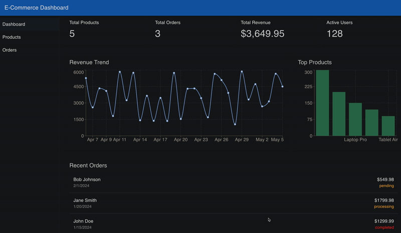

# 🛒 E-Commerce Dashboard

A production‑ready e‑commerce dashboard built with **React**, a **Backend‑for‑Frontend (BFF)** layer, and **Node.js microservices**.

[](https://www.typescriptlang.org/)
[](https://react.dev/)
[](https://nodejs.org/)

---



---

## 📐 Architecture

```
      ┌─────────────────────────────────────┐
      │          Frontend (React)           │
      │  Components · Pages · Hooks · API   │
      └────────────────┬────────────────────┘
                       │  /api/*  (proxied)
                       ▼
      ┌─────────────────────────────────────┐
      │       BFF Layer (Express)           │
      │  Aggregation · Transformation · Auth│
      └──┬──────────────┬───────────────────┘
         │              │
         ▼              ▼
      ┌───────────┐  ┌─────────────┐
      │  Product  │  │   Order     │
      │  Service  │  │  Service    │
      └───────────┘  └─────────────┘
```

- **Frontend** – React SPA with Material‑UI, Recharts, and React Router.
- **BFF (Backend for Frontend)** – Express server that aggregates data from microservices, handles authentication, and transforms responses for the UI.
- **Microservices** – Standalone Node.js/Express services (currently providing static mock data) that can be replaced with database‑backed services.
- **Shared Types** – A single TypeScript module (`shared-types/dashboard.ts`) imported by both the frontend and the BFF, ensuring a **contract** between the two layers.

---

## 🧰 Tech Stack

| Layer         | Technology                                                             |
| ------------- | ---------------------------------------------------------------------- |
| Frontend      | React 18, TypeScript, Vite, Material‑UI, Recharts, React Router, Axios |
| BFF           | Node.js, Express, TypeScript, Axios, Winston, Helmet, Compression      |
| Microservices | Node.js, Express, TypeScript (static mock data)                        |
| Shared Types  | TypeScript `shared-types/` directory                                   |
| Dev Tools     | ts‑node‑dev, ts‑node, ESLint                                           |
| Container     | Docker, Docker Compose (optional)                                      |

---

## 🚀 Getting Started

### Prerequisites

- **Node.js ≥ 18** (with pnpm)
- **Three terminal windows** (or a process manager)
- **curl** (optional, to verify endpoints)

### 1. Clone and Install Dependencies

```bash
git clone https://github.com/yourusername/ecommerce-dashboard.git
cd ecommerce-dashboard

# Install BFF, frontend, and microservice dependencies
cd bff && pnpm install && cd ..
cd frontend && pnpm install && cd ..
cd microservices/product-service && pnpm install && cd ../..
cd microservices/order-service && pnpm install && cd ../..
```

### 2. Start the Microservices

Open two terminals:

**Terminal 1 – Product Service**

```bash
cd microservices/product-service
pnpm dev          # Port 3002
```

**Terminal 2 – Order Service**

```bash
cd microservices/order-service
pnpm dev          # Port 3003
```

Verify they are running:

```bash
curl http://localhost:3002/products/count   # → {"count":5}
curl http://localhost:3003/orders/count      # → {"count":3}
```

### 3. Start the BFF

In a third terminal:

```bash
cd bff
npm dev          # Port 3001
```

Verify:

```bash
curl http://localhost:3001/api/dashboard/summary   # → full dashboard JSON
```

### 4. Start the Frontend

```bash
cd frontend
pnpm dev          # Port 5173
```

Open **http://localhost:5173** in your browser.
You should see the dashboard with real aggregated data.

---

### Docker (Alternative)

To run everything in containers:

```bash
docker-compose up --build
```

The frontend will be available at **http://localhost**.

---

## 📡 API Documentation

All API endpoints are served by the **BFF** at `/api/*`.
The request and response shapes are defined in the shared types (`shared-types/dashboard.ts`) and are **identical** for both frontend and backend.

### Authentication

Currently the auth middleware is a **placeholder** that allows all requests.
When enabled, send a Bearer token:

```
Authorization: Bearer <JWT_TOKEN>
```

The frontend `apiService` automatically attaches the token from `localStorage.auth_token`.

---

### 🔹 Dashboard

#### `GET /api/dashboard/summary`

Aggregates data from the Product, Order, and User microservices.

**Response** – `DashboardSummary`

```json
{
  "totalProducts": 5,
  "totalOrders": 3,
  "totalRevenue": 3649.95,
  "activeUsers": 128,
  "recentOrders": [
    {
      "id": "ORD-001",
      "customerName": "John Doe",
      "amount": 1299.99,
      "status": "completed",
      "date": "2024-01-15T10:30:00Z"
    }
  ],
  "topProducts": [
    {
      "id": "3",
      "name": "Wireless Headphones",
      "sales": 300,
      "revenue": 59997.0,
      "image": "headphones.jpg"
    }
  ],
  "revenueChart": [
    {
      "date": "Jan 15",
      "revenue": 2450,
      "orders": 12
    }
  ]
}
```

Caching: `Cache-Control: public, max-age=30`

---

### 🔹 Products

#### `GET /api/products`

Lists products with optional filtering and pagination.

| Query Param | Type   | Default | Description        |
| ----------- | ------ | ------- | ------------------ |
| category    | string | –       | Filter by category |
| page        | number | 1       | Page number        |
| limit       | number | 10      | Items per page     |

**Response**

```json
{
  "products": [
    {
      "id": "1",
      "name": "Laptop Pro",
      "price": 1299.99,
      "stock": 50,
      "category": "Electronics",
      "image": "laptop.jpg",
      "description": ""
    }
  ],
  "total": 5
}
```

#### `GET /api/products/:id`

Returns a single `Product` object (404 if not found).

---

### 🔹 Orders

#### `GET /api/orders`

Lists orders with optional filtering and pagination.

| Query Param | Type   | Default | Description            |
| ----------- | ------ | ------- | ---------------------- |
| status      | string | –       | Filter by order status |
| page        | number | 1       | Page number            |
| limit       | number | 10      | Items per page         |

**Response**

```json
{
  "orders": [
    {
      "id": "ORD-001",
      "customerId": "...",
      "customerName": "John Doe",
      "products": [
        {
          "productId": "1",
          "productName": "Laptop Pro",
          "quantity": 1,
          "price": 1299.99
        }
      ],
      "totalAmount": 1299.99,
      "status": "completed",
      "createdAt": "2024-01-15T10:30:00Z",
      "shippingAddress": "123 Main St, City, Country"
    }
  ],
  "total": 3
}
```

#### `GET /api/orders/:id`

Returns a single `Order` object (404 if not found).

---

## 📁 Project Structure

```
ecommerce-dashboard/
├── shared-types/                  # TypeScript interfaces for front‑end & BFF
│   └── dashboard.ts
├── frontend/                      # React application
│   ├── src/
│   │   ├── components/            # Reusable UI components (Layout, etc.)
│   │   ├── pages/                 # Page components (Dashboard, Products, Orders, ...)
│   │   ├── hooks/                 # Custom React hooks (useDashboard, useProducts)
│   │   ├── services/              # API service layer (api.ts)
│   │   └── ...
│   ├── vite.config.ts
│   └── package.json
├── bff/                           # Backend for Frontend
│   ├── src/
│   │   ├── routes/                # Express route handlers
│   │   ├── services/              # Business logic & microservice aggregation
│   │   ├── middleware/            # Auth, logging, etc.
│   │   ├── utils/                 # Logger utility
│   │   └── server.ts
│   ├── tsconfig.json
│   └── package.json
├── microservices/
│   ├── product-service/           # Mock Product microservice
│   └── order-service/             # Mock Order microservice
├── docker-compose.yml             # Docker orchestration (optional)
└── README.md
```

---

## 🔒 Keeping Frontend & BFF Synchronized

The **shared types** in `shared-types/dashboard.ts` are the single source of truth.
Both the frontend and the BFF import from `@shared/dashboard` via TypeScript path aliases.

- **BFF**: `tsconfig.json` maps `@shared/*` → `../shared-types/*`
- **Frontend**: `vite.config.ts` and `tsconfig.json` map `@shared/*` → `../shared-types/*`

A change in the shared types will instantly cause a compilation error if the BFF or frontend no longer respect the contract – keeping the two layers **always synchronized**.

---

## 🧪 Verification

Use the following checklist to verify the entire stack:

1. Microservices return expected JSON on their direct ports.
2. BFF aggregates data correctly (test with `curl`).
3. Frontend loads the Dashboard with real numbers and charts.
4. No CORS errors – always access via the Vite proxy (`http://localhost:5173`), not the BFF directly.

---

## 🗺️ Roadmap

- **Phase 1** ✅ Dashboard with aggregated data
- **Phase 2** ✅ Full CRUD for products & orders
- **Phase 3** → Authentication & user management
- **Phase 4** → Replace mock microservices with database‑backed services and use Go in place of TypeScript
- **Phase 5** → Observability, CI/CD, and production deployment
